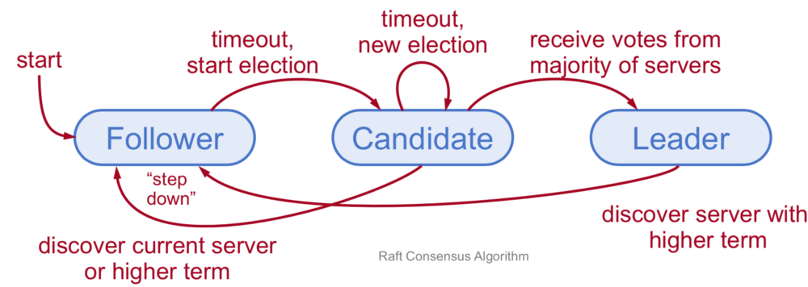
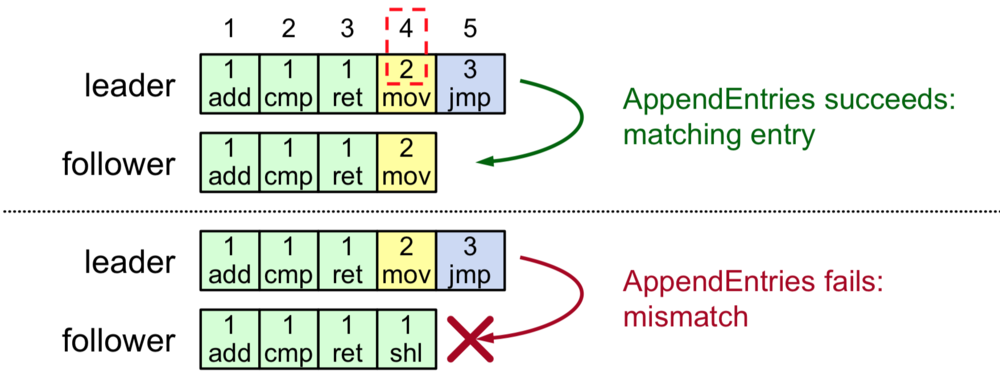
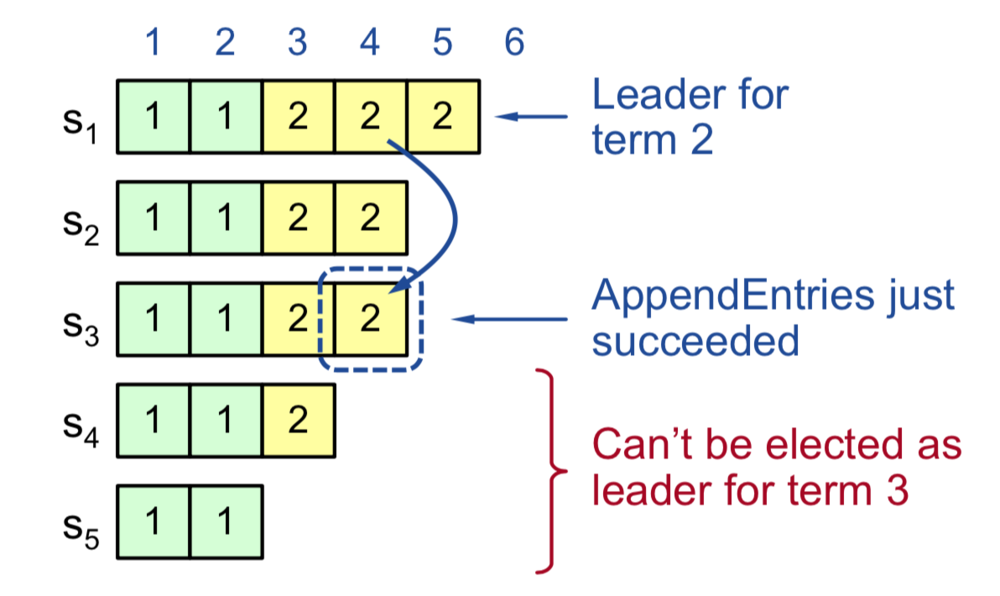
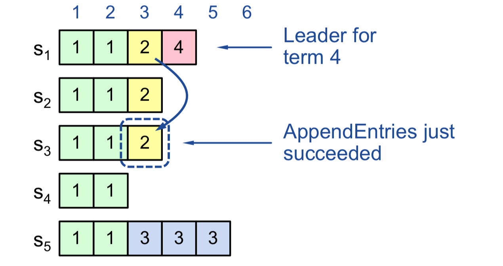
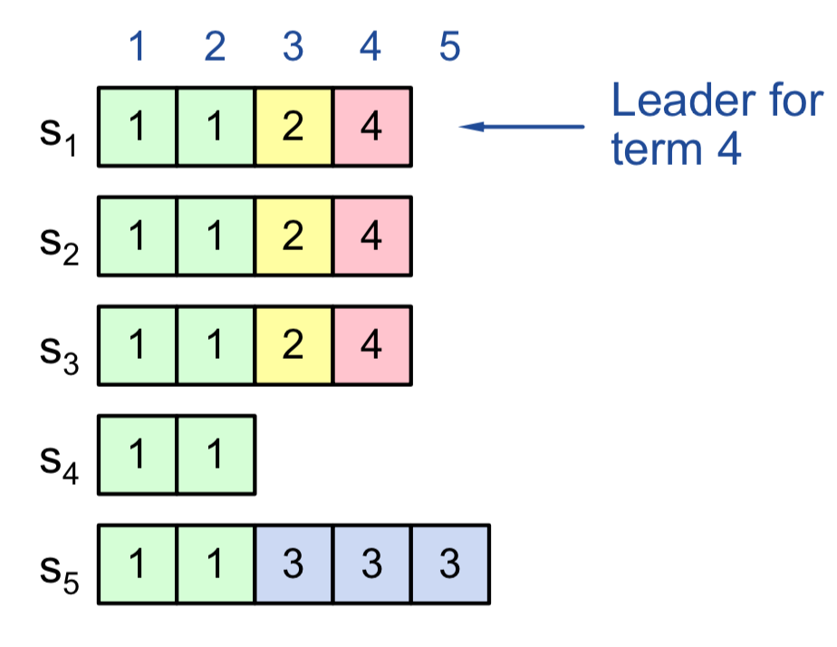
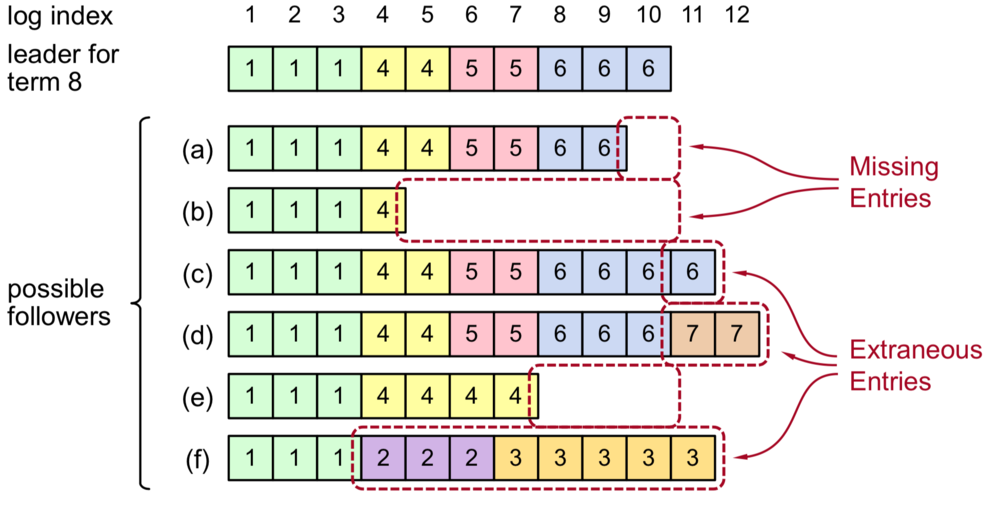
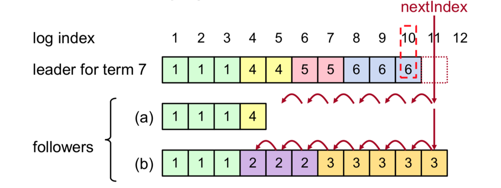
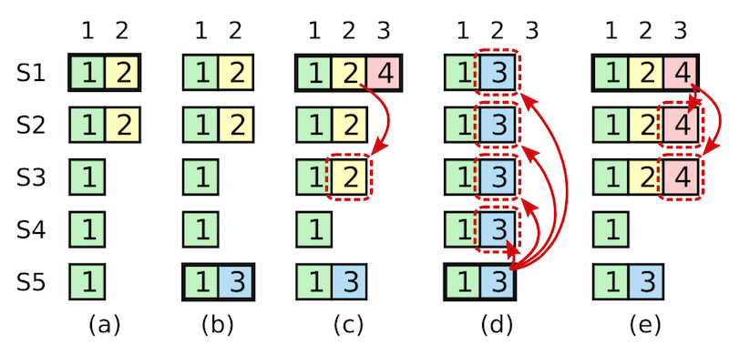
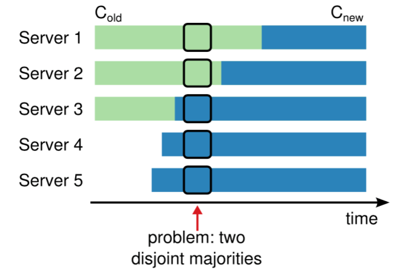
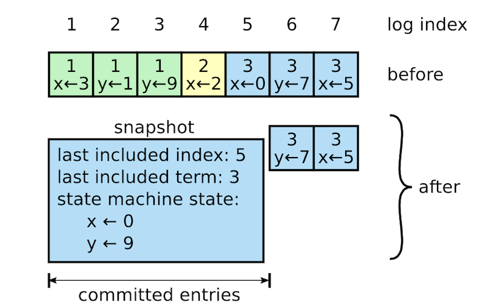

# raft共识算法

## 前言之前的说明
记录下曾经写过的raft算法
没有实现快照，线性一致性读等功能，后续有了sofa-jraft，对比了下，确实实现更好，功能更全，仅从代码量都不是一个量级的，这个适合raft实现的入门，所以直接改用人家的实现了

## 前言
解决分布式数据一致性
共识机制一般分两种情况：

- 非拜占庭错误的算法：所有节点都是可信任的，使用paxos、raft和其变种

- 拜占庭错误的算法： pbft、pow算法等

实际系统中使用的一致性算法通常含有以下特性：

- 安全性保证（绝对不会返回一个错误的结果）：在非拜占庭错误情况下，包括网络延迟、分区、丢包、冗余和乱序等错误都可以保证正确。

- 可用性：集群中只要有大多数的机器可运行并且能够相互通信、和客户端通信，就可以保证可用。因此，一个典型的包含 5 个节点的集群可以容忍两个节点的失败。服务器被停止就认为是失败。他们当有稳定的存储的时候可以从状态中恢复回来并重新加入集群。

- 不依赖时序来保证一致性：物理时钟错误或者极端的消息延迟在可能只有在最坏情况下才会导致可用性问题。

通常情况下，一条指令可以尽可能快的在集群中大多数节点响应一轮远程过程调用时完成。小部分比较慢的节点不会影响系统整体的性能。

##  Raft算法

Raft 通过选举一个领导人，然后给予他全部的管理复制日志的责任来实现一致性。领导人从客户端接收日志条目，把日志条目复制到其他服务器上，并且当保证安全性的时候告诉其他的服务器应用日志条目到他们的状态机中。拥有一个领导人大大简化了对复制日志的管理。例如，领导人可以决定新的日志条目需要放在日志中的什么位置而不需要和其他服务器商议，并且数据都从领导人流向其他服务器。一个领导人可以宕机，可以和其他服务器失去连接，这时一个新的领导人会被选举出来。

通过领导人的方式，Raft 将一致性问题分解成了三个相对独立的子问题：

- **Leader选举**：当没有领导人或先存的领导人宕机的时候，一个新的领导人需要被选举出来

- **日志复制**：领导人必须从客户端接收日志然后复制到集群中的其他节点，并且强制要求其他节点的日志保持和自己相同。

- **安全性**：如果有任何的服务器节点已经应用了一个确定的日志条目到它的状态机中，那么其他服务器节点不能在同一个日志索引位置应用一个不同的指令。

### Leader选举

在Raft中，任何时候一个服务器可以扮演下面角色之一：

- **Leader**: 处理所有客户端交互，日志复制等，同一时刻至多一个，要么一个leader，要么没leader

- **Follower**: 类似选民，完全被动，不能主动发出请求，只能响应来自其他server的请求

- **Candidate**候选人:可以被选为一个新的领导人。

角色状态变迁图

- 处于Follower状态的节点在一个随机的超时时间(称之为Election timeout，注意每次都要随机选择一个超时时间，这个超时时间通常为100-500ms毫秒，超时时间没有收到投票或者日志复制和心跳包的RPC，则会变成Candidate状态。

- 处于Candidate状态的节点会马上开始选举投票。它先投自己一票，然后向其他节点发送投票，这个请求称之为Request Vote RPC。如果获得了过半的节点投票，则转成Leader状态。如果投票给了其他节点或者发现了更新任期(Term)的指令(如更新任期的选举投票和日志复制指令)，则转为Follower状态。如果选举超时没有得到过半投票，则保持Candidate状态开始一个新一轮选举投票。

- 处于Leader状态的节点会定期发送心跳请求给其他节点(这个时间为HeartbeatTimeout，通常要远小于选举超时)。如果发现了更新任期的指令，则转为Follower状态。

选举投票需要两个条件：

- 条件一：请求投票的节点的任期必须大于等于本节点且本节点还没有投过票给其他节点(包括投票给自己)。

- 条件二：请求投票的节点的日志必须是包含了最新提交日志的节点，这是为了保证日志安全增加的限制条件。如何保证请求投票节点包含了最新提交日志呢？可以比较两个节点最后一条日志的任期，如果任期不一样，则任期大的日志更新；如果任期一样，则日志更长的更新。

### 日志复制

Raft是强Leader机制，日志只能从Leader复制到其他节点。日志项LogEntry包括index，term，command三个元素。其中index为日志索引，term为任期，而command为具体的日志内容。

通常的日志复制流程是这样的:

- 客户端发送请求给Leader。

- Leader接收客户端请求，先将请求命令作为一个日志项(LogEntry)append到自己的log中。

- Leader然后在最近的一个Heartbeat timeout时发送 Append Entries RPC给Follower节点。

    - 一旦日志提交成功： 
    - 此时日志处于Uncommitted状态，当过半节点添加log成功后，则Leader提交该日志给状态机，返回给客户端写入成功。并在接下来的Append Entries RPC中通知其他节点提交该日志。

- Follower节点提交日志到自己的状态机中。

- 如果Leader节点挂了，其他Follower节点会在超时后重新选举新的Leader。而如果有宕机或者慢的Follower节点，则Leader会不断重试直到成功。

即便出现网络分割，集群中同时存在多个Leader时，也不会有问题。假定5个节点的集群分割成了3节点和2节点两个大小集群，3节点大集群因为数目3过半，可成功提交日志，而节点数不够的小集群没法成功提交日志。当网络恢复时，因为另外分割的一个大集群已经成功提交了日志，最终新的Leader会在大集群中产生(基于选举投票的条件二保证)并同步到之前分割的小集群节点中。

关于日志复制的几个要点:

1. 不同的服务器上面的提交的相同的索引和任期的日志项的command一定相同，而且这个日志项之前的所有日志项都相同。

2. 如果一个日志项被提交，则它之前索引的所有日志项也肯定已经提交。

3. Leader从来都不覆盖自己的日志。其他状态节点如果出现与当前Leader日志不一致，则需要更新日志，包括写入新的日志和删除不一致的日志。

4. Leader提交过的日志一定会出现将来新的Leader中。

5. Leader要保证安全的提交日志，必须满足这两个提交规则：

    - 日志条目已经复制到大多数Follower节点。

    - Leader当前任期的新日志条目至少有一个复制到了大多数Follower节点。

时序和可用性:

- Raft能够选举出并保持一个稳定的Leader需要系统满足如下时序要求：

    broadcastTime << electionTimeout << MTBF

    其中broadcastTime是指一台服务器并行地向集群其他服务器发送RPC并接收到响应的平均时间，而electionTimeout是选举超时时间，MTBF则是指单个服务器发生故障的平均间隔时间。broadcastTime远小于electionTimeout可以保证Leader持续发送心跳包给Follower节点以防止Follower节点发起选举，electionTimeout远小于MTBF是为了保证系统的稳定运行。Leader崩溃后，理论上大约只有electionTimeout的时间内服务不可用。

根据存储方式的不同，broadcastTime一般设置为0.5ms到100ms，而electionTimeout一般是300-5000ms

### 如何确保安全-Raft日志复制状态分析

#### 前一条日志相同才能复制成功

#### Leader最新任期有日志已经复制到了大多数节点(安全)

S1-S3在任期2已复制成功了第4条LogEntry，这个时候Leader必须包括第4个LogEntry，因此重新选举时S4和S5都不能选举为Leader，第4条日志可以安全提交。

####  Leader试图从一个较老的任期提交日志(不安全)

这时候如果提交第3条LogEntry是不安全的，因为后续如果S5选举为Leader的话会覆盖S1,S2,S3的第3条日志。

####  Leader安全的提交日志

此时Leader最新任期4的一个日志条目4已经复制到大多数节点S1-S3，此时S5不能选举成功，日志条目3和4都是安全的。这就印证了前面提到的**Leader****当前任期的新日志条目至少有一个复制到了大多数Follower节点才能提交。**

####  Leader变化导致日志不一致

Leader变化会导致各节点日志不一致，则需要做如下处理：

-   新的Leader需要保证Follower的日志与其一致，Follower如果有不一致的多余日志要删除，少了日志则要添加。如下面处理流程图中的(a)是需要添加缺少的日志，(b)则是要删除不一致的多余的日志再添加新的日志。
-   Leader会给每个Follower维护一个nextIndex列表，记录要发送给对应Follower节点的下一个日志的索引。
-   如果Follower复制日志失败，Leader需要减小nextIndex并重试。

#### 提交之前任期内的日志条目

领导人知道一条当前任期内的日志记录是可以被提交的，只要它被存储到了大多数的服务器上。如果一个领导人在提交日志条目之前崩溃了，未来后续的领导人会继续尝试复制这条日志记录。然而，一个领导人不能断定一个之前任期里的日志条目被保存到大多数服务器上的时候就一定已经提交了。下图 展示了一种情况，一条已经被存储到大多数节点上的老日志条目，也依然有可能会被未来的领导人覆盖掉。

- 在 (a) 中，S1 是领导者，部分的复制了索引位置 2 的日志条目。

- 在 (b) 中，S1 崩溃了，然后 S5 在任期 3 里通过 S3、S4 和自己的选票赢得选举，然后从客户端接收了一条不一样的日志条目放在了索引 2 处。

- 然后到 (c)，S5 又崩溃了；S1 重新启动，选举成功，开始复制日志。在这时，来自任期 2 的那条日志已经被复制到了集群中的大多数机器上，但是还没有被提交。如果 S1 在 (d) 中又崩溃了，S5 可以重新被选举成功（通过来自 S2，S3 和 S4 的选票），然后覆盖了他们在索引 2 处的日志。反之，如果在崩溃之前，S1 把自己主导的新任期里产生的日志条目复制到了大多数机器上，就如 (e) 中那样，那么在后面任期里面这些新的日志条目就会被提交（因为S5 就不可能选举成功）。 这样在同一时刻就同时保证了，之前的所有老的日志条目就会被提交。

#### 选择最佳的leader

### 遵循规则

所有服务器：

-   如果commitIndex > lastApplied，那么就 lastApplied 加一，并把log[lastApplied]应用到状态机中
-   如果接收到的 RPC 请求或响应中，任期号T > currentTerm，那么就令 currentTerm 等于 T，并切换状态为跟随者

跟随者：

-   响应来自候选人和领导者的请求
-   如果在超过选举超时时间的情况之前都没有收到领导人的心跳，或者是候选人请求投票的，就自己变成候选人

候选人：

-   在转变成候选人后就立即开始选举过程

-   自增当前的任期号（currentTerm）
-   给自己投票
-   重置选举超时计时器
-   发送请求投票的 RPC 给其他所有服务器

-   如果接收到大多数服务器的选票，那么就变成领导人
-   如果接收到来自新的领导人的附加日志 RPC，转变成跟随者
-   如果选举过程超时，再次发起一轮选举

领导人：

-   一旦成为领导人：发送空的附加日志 RPC（心跳）给其他所有的服务器；在一定的空余时间之后不停的重复发送，以阻止跟随者超时
-   如果接收到来自客户端的请求：附加条目到本地日志中，在条目被应用到状态机后响应客户端
-   如果对于一个跟随者，最后日志条目的索引值大于等于 nextIndex，那么：发送从 nextIndex 开始的所有日志条目：

-   如果成功：更新相应跟随者的 nextIndex 和 matchIndex
-   如果因为日志不一致而失败，减少 nextIndex 重试

-   如果存在一个满足N > commitIndex的 N，并且大多数的matchIndex[i] ≥ N成立，并且log[N].term == currentTerm成立，那么令 commitIndex 等于这个 N

### 集群成员变化

在图中红色剪头的时间点，旧配置的集群下Server[1,2]可以选举Server1为Leader，Server3不同意没关系，过半就行。而同样的时间，新配置的集群下Server[3,4,5]则可以选举出Server5为另外一个Leader。这时候就存在多Leader并存问题。

为了避免这个问题，Raft使用单节点变更算法。一次只允许变动一个节点，并且要按顺序变更不允许并行交叉，否则会出现混乱。如果你想从3个节点变成5个节点，那就先变成4节点，再变成5节点。变更单节点的好处是集群不会分裂，不会同时存在两个Leader。  

### 日志压缩

每个服务器独立的创建快照，只包括已经被提交的日志。主要的工作包括将状态机的状态写入到快照中。Raft 也包含一些少量的元数据到快照中：**最后被包含索引**指的是被快照取代的最后的条目在日志中的索引值（状态机最后应用的日志），**最后被包含的任期**指的是该条目的任期号。保留这些数据是为了支持快照前的第一个条目的附加日志请求时的一致性检查，因为这个条目需要最后的索引值和任期号。为了支持集群成员更新，快照中也将最后的一次配置作为最后一个条目存下来。一旦服务器完成一次快照，他就可以删除最后索引位置之前的所有日志和快照了。

尽管通常服务器都是独立的创建快照，但是领导人必须偶尔的发送快照给一些落后的跟随者。这通常发生在当领导人已经丢弃了下一条需要发送给跟随者的日志条目的时候。幸运的是这种情况不是常规操作：一个与领导人保持同步的跟随者通常都会有这个条目。然而一个运行非常缓慢的跟随者或者新加入集群的服务器将不会有这个条目。这时让这个跟随者更新到最新的状态的方式就是通过网络把快照发送给他们。

  

### 总结

| 特性       | 解释                                                          |
|----------|-------------------------------------------------------------|
| 领导人只附加原则 | 领导人绝对不会删除或者覆盖自己的日志，只会增加                                     |
| 日志匹配原则   | 如果两个日志在相同的索引位置的日志条目的任期号相同，那么我们就认为这个日志从头到这个索引位置之间全部完全相同      |
| 领导人完全特性  | 如果某个日志条目在某个任期号中已经被提交，那么这个条目必然出现在更大任期号的所有领导人中                |
| 状态机安全特性  | 如果一个领导人已经在给定的索引值位置的日志条目应用到状态机中，那么其他任何的服务器在这个索引位置不会提交一个不同的日志 |

如果两个日志在相同的索引位置的日志条目的任期号相同，那么我们就认为这个日志从头到这个索引位置之间全部完全相同

领导人完全特性

如果某个日志条目在某个任期号中已经被提交，那么这个条目必然出现在更大任期号的所有领导人中

状态机安全特性

如果一个领导人已经在给定的索引值位置的日志条目应用到状态机中，那么其他任何的服务器在这个索引位置不会提交一个不同的日志

  

## 系统设计

### Raft共识节点功能设计
此图来自sofa-jraft

### 节点状态和RPC请求说明

#### 状态
|状态|所有服务器上持久存在的|
|-------|------|
|currentTerm | 服务器最后一次知道的任期号（初始化为 0，持续递增）|
|votedFor | 在当前获得选票的候选人的 Id|
| log[] | 日志条目集；每一个条目包含一个用户状态机执行的指令，和收到时的任期号 |

|状态|所有服务器上经常变的|
|-------|------|
| commitIndex| 已知的最大的已经被提交的日志条目的索引值|
| lastApplied| 最后被应用到状态机的日志条目索引值（初始化为 0，持续递增）|

| 状态 | 在领导人里经常改变的 （选举后重新初始化）|
|----|--------|
| nextIndex[] | 对于每一个服务器，需要发送给他的下一个日志条目的索引值（初始化为领导人最后索引值加一）|
| matchIndex[] | 对于每一个服务器，已经复制给他的日志的最高索引值|

#### 附加日志 RPC

由领导人负责调用来复制日志指令；也会用作heartbeat

| 参数 | 解释 |
|----|----|
|term| 领导人的任期号|
|leaderId| 领导人的 Id，以便于跟随者重定向请求|
|prevLogIndex|新的日志条目紧随之前的索引值|
|prevLogTerm|prevLogIndex 条目的任期号|
|entries[]|准备存储的日志条目（表示心跳时为空；一次性发送多个是为了提高效率）|
|leaderCommit|领导人已经提交的日志的索引值|

| 返回值| 解释|
|---|---|
|term|当前的任期号，用于领导人去更新自己|
|success|跟随者包含了匹配上 prevLogIndex 和 prevLogTerm 的日志时为真|

接收者实现：

1. 如果 `term < currentTerm` 就返回 false 
2. 如果日志在 prevLogIndex 位置处的日志条目的任期号和 prevLogTerm 不匹配，则返回 false 
3. 如果已经存在的日志条目和新的产生冲突（索引值相同但是任期号不同），删除这一条和之后所有的 
4. 附加日志中尚未存在的任何新条目
5. 如果 `leaderCommit > commitIndex`，令 commitIndex 等于 leaderCommit 和 新日志条目索引值中较小的一个

**请求投票 RPC**：

由候选人负责调用用来征集选票

| 参数 | 解释|
|---|---|
|term| 候选人的任期号|
|candidateId| 请求选票的候选人的 Id |
|lastLogIndex| 候选人的最后日志条目的索引值|
|lastLogTerm| 候选人最后日志条目的任期号|

| 返回值| 解释|
|---|---|
|term| 当前任期号，以便于候选人去更新自己的任期号|
|voteGranted| 候选人赢得了此张选票时为真|

接收者实现：

1. 如果`term < currentTerm`返回 false 
2. 如果 votedFor 为空或者为 candidateId，并且候选人的日志至少和自己一样新，那么就投票给他

**所有服务器需遵守的规则**：

所有服务器：

* 如果`commitIndex > lastApplied`，那么就 lastApplied 加一，并把`log[lastApplied]`应用到状态机中
* 如果接收到的 RPC 请求或响应中，任期号`T > currentTerm`，那么就令 currentTerm 等于 T，并切换状态为跟随者

跟随者：

* 响应来自候选人和领导者的请求
* 如果在超过选举超时时间的情况之前没有收到**当前领导人**（即该领导人的任期需与这个跟随者的当前任期相同）的心跳/附加日志，或者是给某个候选人投了票，就自己变成候选人

候选人：

* 在转变成候选人后就立即开始选举过程
	* 自增当前的任期号（currentTerm）
	* 给自己投票
	* 重置选举超时计时器
	* 发送请求投票的 RPC 给其他所有服务器
* 如果接收到大多数服务器的选票，那么就变成领导人
* 如果接收到来自新的领导人的附加日志 RPC，转变成跟随者
* 如果选举过程超时，再次发起一轮选举

领导人：

* 一旦成为领导人：发送空的附加日志 RPC（心跳）给其他所有的服务器；在一定的空余时间之后不停的重复发送，以阻止跟随者超时
*  如果接收到来自客户端的请求：附加条目到本地日志中，在条目被应用到状态机后响应客户端
*  如果对于一个跟随者，最后日志条目的索引值大于等于 nextIndex，那么：发送从 nextIndex 开始的所有日志条目：
	* 如果成功：更新相应跟随者的 nextIndex 和 matchIndex
	* 如果因为日志不一致而失败，减少 nextIndex 重试
* 如果存在一个满足`N > commitIndex`的 N，并且大多数的`matchIndex[i] ≥ N`成立，并且`log[N].term == currentTerm`成立，那么令 commitIndex 等于这个 N 

更多流程图参考
中文[翻译地址](https://github.com/99246255/raft/blob/master/docs/raft共识算法.docx)